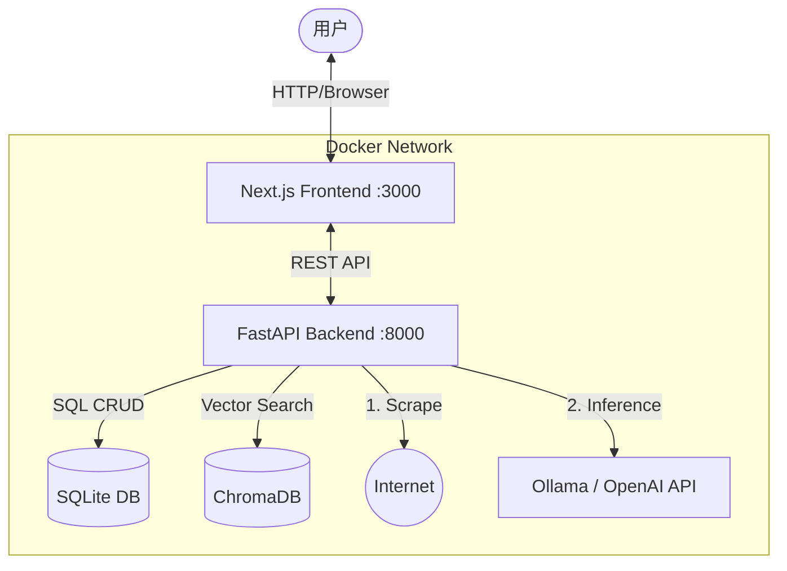

# 📘 SmartMarks - 智能本地书签管理系统技术方案

## 1. 项目概述 (Overview)

**SmartMarks** 是一个运行在本地 Docker 环境中的现代化书签管理系统。它旨在解决传统书签“只存不看、管理混乱、死链腐烂”的问题。核心能力是利用 **LLM (大语言模型)** 对导入的网址进行自动抓取、语义分析、分类和打标签，并提供类似现代 App 的可视化导航面板。

### 1.1 核心特性
*   **私有化部署**：Docker 一键启动，数据存储在本地 SQLite/ChromaDB，隐私安全。
*   **AI 智能整理**：自动抓取网页内容，生成摘要、分类、标签。
*   **混合分析模式**：支持公开网页自动抓取，支持受限网页（需登录）通过“人工辅助上下文”进行二次分析。
*   **语义搜索**：基于向量数据库 (Vector Search)，支持自然语言检索（如搜索“CSS 居中”能找到未包含该关键词的相关技术文章）。
*   **现代化 UI**：Bento Grid（便当盒）布局，支持拖拽排序，响应式设计。

---

## 2. 系统架构 (System Architecture)

采用经典的 **Client-Server** 架构，完全容器化。

### 2.1 容器编排 (Docker Compose)

整个系统由三个主要服务组成：

1.  **Frontend (UI)**: Next.js 应用，负责界面展示与交互。
2.  **Backend (API & Worker)**: FastAPI 应用，负责业务逻辑、爬虫、LLM 对接、数据库读写。
3.  **Local LLM (Optional)**: Ollama 服务（可选，若使用 OpenAI/DeepSeek API 则不需要此容器）。

### 2.2 架构图



---

## 3. 技术栈选型 (Tech Stack)

### 3.1 前端 (Frontend)
*   **Framework**: Next.js 14+ (App Router) - **Requires Node.js 20+**
*   **Language**: TypeScript
*   **Styling**: Tailwind CSS v4 (Note: Use `@import "tailwindcss";` syntax) + Shadcn/UI (Radix UI) + Lucide Icons
*   **State Management**: Zustand (轻量级全局状态) + TanStack Query (API 状态与缓存)
*   **Drag & Drop**: dnd-kit (用于卡片拖拽排序)

### 3.2 后端 (Backend)
*   **Framework**: FastAPI (Python 3.11+)
*   **ORM**: SQLAlchemy (Async) - **Note**: Use absolute paths for SQLite in Docker (e.g., `sqlite+aiosqlite:////data/db/bookmarks.db`)
*   **Validation**: Pydantic V2 (Use `model_config = ConfigDict(from_attributes=True)` or `class Config: from_attributes = True`)
*   **Task Queue**: FastAPI BackgroundTasks (MVP阶段) 或 APScheduler (定时任务)
*   **Web Scraper**: Trafilatura (专注正文提取) + Playwright (可选，后期用于高难度爬虫)
*   **AI Orchestration**: LangChain (用于 Prompt 模板管理和模型调用)

### 3.3 数据存储 (Storage)
*   **Relational DB**: SQLite (单文件 `bookmarks.db`，易于备份)
*   **Vector DB**: ChromaDB (嵌入式模式，本地文件夹存储)

---

## 4. 数据库设计 (Database Schema)

### 4.1 SQLite 表结构

#### `bookmarks` 表
核心数据表，增加了对 AI 分析流程的状态控制字段。

| 字段名 | 类型 | 说明 |
| :--- | :--- | :--- |
| `id` | Integer (PK) | 主键 |
| `url` | String | 原始链接 (Indexed) |
| `title` | String | 网页标题 |
| `desc_user` | Text | **关键设计**: 用户手动补充的上下文 (优先级最高) |
| `desc_ai` | Text | AI 生成的摘要 |
| `content_raw` | Text | 爬虫抓取的正文摘要 (截取前 3k token) |
| `category_id` | Integer (FK) | 关联分类表 |
| `tags` | JSON | 标签数组 e.g. `["react", "frontend"]` |
| `status_process` | Enum | `pending`(待处理), `processing`, `completed`, `failed` |
| `status_scrape` | Enum | `success`, `login_required`(需登录), `dead_link`(死链) |
| `created_at` | DateTime | 创建时间 |

#### `categories` 表
| 字段名 | 类型 | 说明 |
| :--- | :--- | :--- |
| `id` | Integer (PK) | 主键 |
| `name` | String | 分类名称 (e.g., "技术文档") |
| `icon` | String | Lucide 图标名称 |
| `sort_order` | Integer | 用于手动排序 |

### 4.2 向量数据库 (ChromaDB)
*   **Collection**: `bookmarks_vector`
*   **Embedding**: 使用轻量级模型 (如 `text-embedding-3-small` 或本地 `bge-m3`)
*   **Payload**: 存储 `{id: bookmark_id}`，用于反查 SQLite。

---

## 5. 核心业务流程与逻辑 (Core Workflows)

这是系统最智能的部分，包含自动降级和人工干预逻辑。

### 5.1 数据摄入与分析流水线 (The Pipeline)

当用户导入书签或添加 URL 时，后端触发异步任务：

1.  **Step 1: 预检查**
    *   检查 URL 是否已存在。
    *   初始化数据库记录，状态设为 `pending`。

2.  **Step 2: 内容获取 (Scraping)**
    *   尝试使用 HTTP Client (Trafilatura) 访问 URL。
    *   **分支 A (成功)**: 获取到 HTML，提取正文，存入 `content_raw`，标记 `status_scrape = success`。
    *   **分支 B (403/Login)**: 检测到登录页特征或 HTTP 401/403。标记 `status_scrape = login_required`，`content_raw` 为空。
    *   **分支 C (404/Error)**: 标记 `status_scrape = dead_link`。

3.  **Step 3: Prompt 构建 (动态策略)**
    *   LLM 的输入 Context 按照优先级组装：
        1.  `desc_user` (如果用户手动填了，只用这个，最准)
        2.  `content_raw` (如果爬到了，用这个)
        3.  `title` + `url` (保底策略，如果没爬到也没填)

4.  **Step 4: LLM 推理**
    *   调用 LLM 生成 JSON：`{ "category": "...", "tags": [], "summary": "..." }`。

5.  **Step 5: 存储与向量化**
    *   更新 SQLite 记录。
    *   将 `title` + `summary` + `tags` 组合文本，生成 Embedding 存入 ChromaDB。

### 5.2 “人工辅助”补全流程 (The Enrichment Loop)

针对 **分支 B (需登录)** 的网页，前端 UI 提供补救入口：

1.  **UI 展示**: 卡片显示 🔒 图标，Tooltip 提示“需登录，无法自动分析”。
2.  **用户操作**: 点击“补充信息”，弹出 Modal。
3.  **数据提交**: 用户粘贴一段简介，调用 `POST /api/bookmarks/{id}/enrich`。
4.  **系统响应**:
    *   更新 `desc_user` 字段。
    *   **立即重置** `status_process` 为 `pending`。
    *   **重新触发** 上述 Step 3 (Prompt 构建)，此时会命中高优先级的 `desc_user`，从而生成准确分类。

---

## 6. API 接口设计 (API Design)

### 书签管理
*   `POST /api/bookmarks/import`: 上传 HTML 文件批量导入。
*   `GET /api/bookmarks`: 获取列表（支持分页、按分类筛选）。
*   `PATCH /api/bookmarks/{id}`: 手动修改标题、分类、移动位置。
*   `DELETE /api/bookmarks/{id}`: 删除。

### 智能分析辅助
*   `POST /api/bookmarks/{id}/enrich`: **(关键接口)** 提交手动补充的上下文，并触发重分析。
*   `POST /api/bookmarks/{id}/retry`: 强制重试爬虫（用于网络抖动情况）。

### 搜索
*   `GET /api/search?q={query}`: 混合搜索。
    *   先在 ChromaDB 做向量搜索，拿到 Top 20 ID。
    *   再在 SQLite 做关键词模糊匹配 (`LIKE %query%`)。
    *   结果合并去重返回。

---

## 7. 目录结构规范 (Directory Structure)

```text
smart-marks/
├── docker-compose.yml       # 编排文件
├── .env.example             # 环境变量模版
├── data/                    # [Volume] 数据库持久化目录
│   ├── db/                  # SQLite 文件
│   └── chroma/              # 向量库索引
├── backend/                 # FastAPI
│   ├── Dockerfile
│   ├── requirements.txt
│   └── app/
│       ├── main.py          # App 入口
│       ├── core/            # 配置, Logger
│       ├── models/          # SQLAlchemy Models
│       ├── schemas/         # Pydantic Schemas
│       ├── services/
│       │   ├── scraper.py   # 爬虫逻辑 (含降级处理)
│       │   ├── llm.py       # LangChain 调用
│       │   └── vector.py    # ChromaDB 操作
│       └── routers/         # API 路由
└── frontend/                # Next.js
    ├── Dockerfile           # **Must use node:20-alpine or higher**
    ├── package.json
    ├── tailwind.config.ts   # (Optional in v4 if using CSS-first config)
    ├── page.tsx             # Root page (Dashboard)
    ├── layout.tsx           # Root layout
    ├── globals.css          # Global styles (Tailwind imports)
    └── ...
```

**Implementation Notes (Lessons Learned)**:
1.  **Frontend Structure**: Next.js initialization might create a default `app` directory. Ensure custom code takes precedence, or strictly follow the `src/app` vs root `app` convention. Recommended: Use root `app` directory for simplicity in Docker.
2.  **Tailwind V4**: New versions use CSS-first configuration. Ensure `globals.css` uses `@import "tailwindcss";` and avoid undefined utility classes from legacy versions.

---

## 8. 开发路线图 (Roadmap)

为了高效落地，建议分三阶段开发：

### Phase 1: MVP (最小可行性产品)
*   **目标**: 能跑通流程，不含向量搜索，仅基于 OpenAI/Ollama 简单分类。
*   **功能**:
    *   Docker 环境搭建。
    *   HTML 文件导入解析。
    *   后端爬虫 + 简单的 Prompt 分类。
    *   前端列表展示，显示加载状态。

### Phase 2: 交互增强与补全机制
*   **目标**: 解决痛点（登录墙），提升可用性。
*   **功能**:
    *   实现 `status_scrape` 状态判断逻辑。
    *   前端开发“补充信息 Modal”。
    *   后端实现 `enrich` 接口与重分析逻辑。
    *   引入 dnd-kit 实现手动拖拽分类。

### Phase 3: 搜索与扩展
*   **目标**: 变为知识库。
*   **功能**:
    *   集成 ChromaDB，实现语义搜索。
    *   增加定时任务（健康检查）。
    *   UI 美化（暗色模式、移动端适配）。

---

## 9. 最佳实践提示 (Best Practices Tips)

1.  **Prompt 工程**: 在 `llm.py` 中，Prompt 尽量输出纯 JSON。例如使用 `Output only standard JSON, no markdown formatting.` 并在代码中强制 `json.loads` 前进行简单的字符串清理，防止 LLM 啰嗦导致解析失败。
2.  **Rate Limiting**: 如果使用付费 API (OpenAI)，在后台任务中加入简单的速率限制（如每分钟处理 20 个），防止导入 1000 个书签瞬间把信用卡刷爆。
3.  **乐观更新 (Optimistic UI)**: 在前端修改分类或标签时，先在界面上改掉，再发请求。如果请求失败再回滚。这样用户体验会非常丝滑。